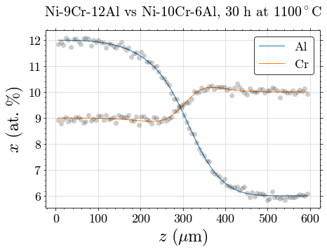

.. Noda documentation master file, created by
   sphinx-quickstart on Tue Oct  8 23:00:10 2019.   
   
Welcome to Noda's documentation
===============================

Noda is an open-source Python package for simulating diffusion in multicomponent
alloys.

Noda uses thermodynamic and mobility data to solve the diffusion problem with
prescribed initial composition and boundary conditions, using the finite
difference method. This version is limited to single-phase systems, isothermal
conditions, one space coordinate (1D planar, 2D cylindrical, 3D spherical).

.. toctree::
   :caption: User guide
   :maxdepth: 1
   
   installation
   getting_started
   basic_use
   advanced_use
   background
   credits

.. toctree::
   :hidden:
   
   api

Package reference
-----------------

Documentation for all modules is found :doc:`here <api>`.

Indices
-------

* :ref:`modindex`
* :ref:`genindex`
